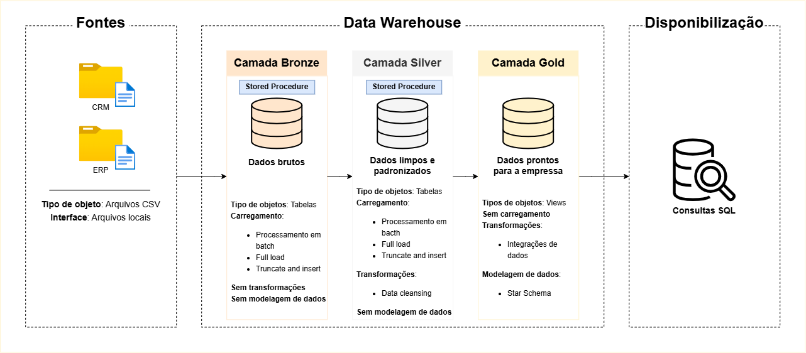
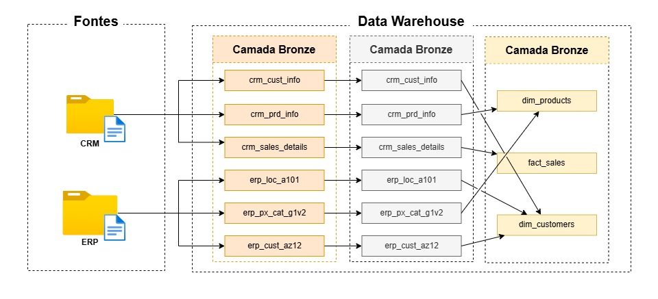
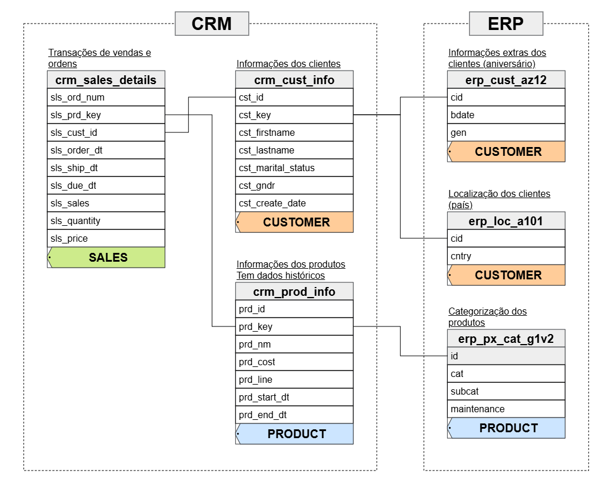
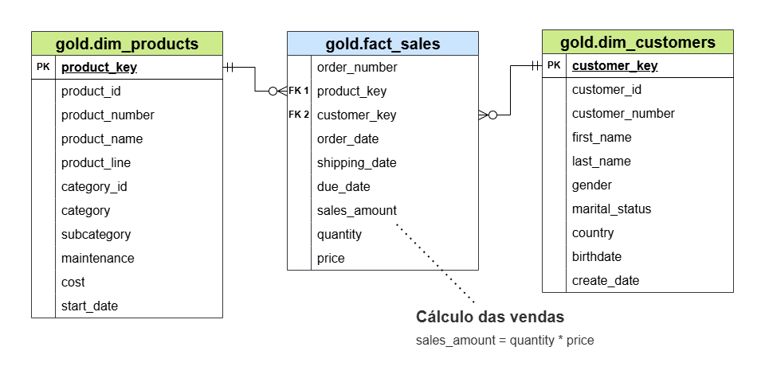

# Data Warehouse — Bootcamp DWH

Data Warehouse em **PostgreSQL** que integra dados de dois sistemas de origem (**CRM** e **ERP**) usando a **Arquitetura Medallion** (Bronze → Silver → Gold), com modelo final em **Star Schema** para consultas analíticas de vendas.

## Sumário

1. [Arquitetura](#1-arquitetura)
2. [Fluxo de dados](#2-fluxo-de-dados)
3. [Modelo de integração (origens)](#3-modelo-de-integração-origens)
4. [Modelo de dados final (Gold)](#4-modelo-de-dados-final-gold)
5. [Estrutura do repositório](#5-estrutura-do-repositório)
6. [Scripts SQL](#6-scripts-sql)
7. [Como rodar o projeto](#7-como-rodar-o-projeto)
8. [Documentos complementares](#8-documentos-complementares)

---

## 1. Arquitetura



| Camada | Conteúdo | Objetos | Carga | Transformação |
|---|---|---|---|---|
| **Fontes** | CSVs do CRM e ERP | Arquivos locais | — | — |
| **Bronze** | Dados brutos, idênticos à origem | Tabelas | Batch, full load (*truncate and insert*) via stored procedure | Nenhuma |
| **Silver** | Dados limpos e padronizados | Tabelas | Batch, full load (*truncate and insert*) via stored procedure | Data cleansing |
| **Gold** | Dados prontos para o negócio | Views | Sem carga (views sobre a Silver) | Integração de dados + Star Schema |

A **disponibilização** é feita por consultas SQL diretamente sobre as views da camada Gold.

## 2. Fluxo de dados



> Na imagem, os três blocos estão rotulados como "Camada Bronze"; o correto é **Bronze → Silver → Gold**, da esquerda para a direita.

| Origem | Bronze / Silver | Gold |
|---|---|---|
| CRM | `crm_cust_info` | `dim_customers` |
| CRM | `crm_prd_info` | `dim_products` |
| CRM | `crm_sales_details` | `fact_sales` |
| ERP | `erp_cust_az12` | `dim_customers` |
| ERP | `erp_loc_a101` | `dim_customers` |
| ERP | `erp_px_cat_g1v2` | `dim_products` |

## 3. Modelo de integração (origens)



Como as tabelas dos dois sistemas se relacionam:

- `crm_sales_details.sls_cust_id` → `crm_cust_info.cst_id`
- `crm_sales_details.sls_prd_key` → `crm_prd_info.prd_key`
- `crm_cust_info.cst_key` → `erp_cust_az12.cid` e `erp_loc_a101.cid`
- `crm_prd_info.prd_key` (parte da categoria) → `erp_px_cat_g1v2.id`

## 4. Modelo de dados final (Gold)



- **`gold.dim_customers`** — 1 registro por cliente (CRM + dados demográficos e país do ERP).
- **`gold.dim_products`** — 1 registro por produto ativo (CRM + categorias do ERP).
- **`gold.fact_sales`** — 1 registro por item de venda, ligado às dimensões por chaves substitutas.
- Cálculo das vendas: `sales_amount = quantity * price`.

O dicionário de dados completo (colunas, tipos, PK/FK) está em [`docs/data_catalog.md`](docs/data_catalog.md).

## 5. Estrutura do repositório

```
dwh_bootcamp/
├── datasets/
│   ├── source_crm/        # cust_info.csv, prd_info.csv, sales_details.csv
│   └── source_erp/        # CUST_AZ12.csv, LOC_A101.csv, PX_CAT_G1V2.csv
├── docs/                  # Imagens da arquitetura, catálogo e convenções
│   └── drawio/            # Arquivos-fonte (.drawio) dos diagramas
├── scripts/
│   ├── init_database.sql
│   ├── bronze/            # ddl_bronze.sql, sp_load_bronze.sql
│   ├── silver/            # ddl_silver.sql, sp_load_silver.sql
│   └── gold/              # ddl_gold.sql
└── tests/                 # silver_quality_checks.sql, gold_quality_checks.sql
```

## 6. Scripts SQL

### `scripts/init_database.sql`
Prepara a base do DWH.
1. Remove o banco `data_warehouse`, se existir.
2. Cria o banco `data_warehouse`.
3. Cria os schemas `bronze`, `silver` e `gold`.

> ⚠️ Apaga o banco existente por completo.

### `scripts/bronze/ddl_bronze.sql`
Cria as 6 tabelas brutas (3 do CRM, 3 do ERP) com a mesma estrutura dos CSVs.

### `scripts/bronze/sp_load_bronze.sql`
Cria a procedure `bronze.load_bronze()`.
1. Para cada tabela: `TRUNCATE` e depois `COPY` do CSV correspondente.
2. Exibe o tempo de carga por tabela e o total.
3. Em caso de erro, informa tabela, SQLSTATE e mensagem.

### `scripts/silver/ddl_silver.sql`
Cria as 6 tabelas da Silver, com tipos adequados e coluna técnica de data de carga.

### `scripts/silver/sp_load_silver.sql`
Cria a procedure `silver.load_silver()`, que lê da Bronze, trata e grava na Silver (`TRUNCATE` + `INSERT`).

| Tabela | Tratamentos principais |
|---|---|
| `crm_cust_info` | Remove duplicados e IDs nulos; remove espaços; padroniza estado civil e gênero |
| `crm_prd_info` | Separa chave do produto e da categoria; trata custo nulo; padroniza linha do produto; calcula data de fim de vigência |
| `crm_sales_details` | Converte datas inválidas; corrige valores de venda e preço |
| `erp_cust_az12` | Normaliza ID; valida data de nascimento; padroniza gênero |
| `erp_loc_a101` | Normaliza ID; padroniza nomes de países |
| `erp_px_cat_g1v2` | Corrige identificadores de categoria |

### `scripts/gold/ddl_gold.sql`
Cria as views do Star Schema.
1. `dim_customers`: junta CRM + ERP (nascimento, gênero, país) e gera `customer_key`.
2. `dim_products`: junta produtos + categorias, mantém só os ativos (sem data de fim) e gera `product_key`.
3. `fact_sales`: liga as vendas às dimensões pelas chaves substitutas.

### `tests/silver_quality_checks.sql`
Consultas de diagnóstico sobre a Bronze: duplicados, nulos, espaços, valores fora do padrão, datas inválidas, regras de vendas e consistência CRM × ERP. Define o que a Silver precisa tratar. Somente leitura.

### `tests/gold_quality_checks.sql`
Consultas de validação da Gold: integração das dimensões, duplicidades e integridade referencial entre fato e dimensões. Somente leitura.

## 7. Como rodar o projeto

### Pré-requisitos
- PostgreSQL (com `psql` ou um cliente como DBeaver / pgAdmin).
- Usuário com permissão de criar banco e executar `COPY` (superusuário ou `pg_read_server_files`).
- Os CSVs precisam estar acessíveis **pelo servidor** PostgreSQL.

### Passo a passo

1. **Clonar o repositório**
   ```bash
   git clone https://github.com/matheusventuranellessen/dwh_bootcamp.git
   cd dwh_bootcamp
   ```

2. **Ajustar os caminhos dos CSVs** em `scripts/bronze/sp_load_bronze.sql`.
   Os caminhos atuais são de uma máquina local (`C:/Users/2992529/...`). Troque pelo caminho absoluto da pasta `datasets/` no seu ambiente (6 ocorrências de `FROM '...'`).

3. **Criar o banco e os schemas** — execute `scripts/init_database.sql`.
   Depois, **conecte-se ao banco `data_warehouse`** (o script não faz essa troca automaticamente) antes de executar os próximos.

4. **Criar as tabelas e procedures**, nesta ordem:

   | # | Script |
   |---|---|
   | 1 | `scripts/bronze/ddl_bronze.sql` |
   | 2 | `scripts/bronze/sp_load_bronze.sql` |
   | 3 | `scripts/silver/ddl_silver.sql` |
   | 4 | `scripts/silver/sp_load_silver.sql` |
   | 5 | `scripts/gold/ddl_gold.sql` |

5. **Carregar os dados**
   ```sql
   CALL bronze.load_bronze();
   CALL silver.load_silver();
   ```

6. **Validar e consultar**
   - Execute `tests/silver_quality_checks.sql` e `tests/gold_quality_checks.sql`.
   - Consulte a Gold:
     ```sql
     SELECT * FROM gold.fact_sales LIMIT 10;
     ```

### Reexecução
Para recarregar os dados, basta repetir o passo 5 (as procedures fazem `TRUNCATE` antes de inserir). A Gold é composta por views, então reflete a Silver automaticamente.

## 8. Documentos complementares

- [`docs/data_catalog.md`](docs/data_catalog.md) — dicionário de dados da camada Gold.
- [`docs/naming_conventions.md`](docs/naming_conventions.md) — convenções de nomenclatura.
- [`docs/drawio/`](docs/drawio/) — diagramas editáveis.
