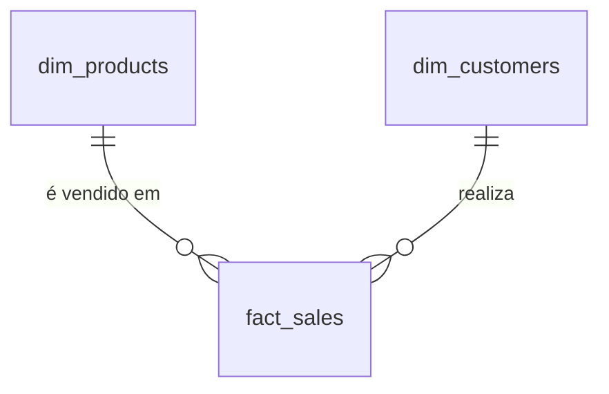

# Dicionário de Dados da Camada Gold

## Visão geral

A Camada Gold representa os dados no nível de negócio e é estruturada para atender casos de uso analíticos e de geração de relatórios. Ela é composta por **tabelas de dimensão** e **tabelas fato** relacionadas a métricas específicas do negócio.

### 1. **gold.dim_customers**

- **Finalidade**: Armazena informações dos clientes enriquecidas com dados demográficos e geográficos.
- **Granularidade**: 1 registro representa 1 cliente.
- **Colunas**:

| Nome da coluna | Tipo de dado | PK | FK | Referência | Descrição |
|---|---|---|---|---|---|
| `customer_key` | `INT` | ✅ |  |  | Chave substituta que identifica exclusivamente cada registro de cliente na tabela de dimensão. |
| `customer_id` | `INT` |  |  |  | Identificador numérico exclusivo atribuído a cada cliente. |
| `customer_number` | `NVARCHAR(50)` |  |  |  | Identificador alfanumérico que representa o cliente, utilizado para rastreamento e referência. |
| `first_name` | `NVARCHAR(50)` |  |  |  | Primeiro nome do cliente, conforme registrado no sistema. |
| `last_name` | `NVARCHAR(50)` |  |  |  | Sobrenome ou nome de família do cliente. |
| `country` | `NVARCHAR(50)` |  |  |  | País de residência do cliente (ex.: `Australia`). |
| `marital_status` | `NVARCHAR(50)` |  |  |  | Estado civil do cliente (ex.: `Married`, `Single`). |
| `gender` | `NVARCHAR(50)` |  |  |  | Gênero do cliente (ex.: `Male`, `Female`, `n/a`). |
| `birthdate` | `DATE` |  |  |  | Data de nascimento do cliente, formatada como `YYYY-MM-DD` (ex.: `1971-10-06`). |
| `create_date` | `DATE` |  |  |  | Data e hora em que o registro do cliente foi criado no sistema. |

### 2. **gold.dim_products**

- **Finalidade**: Disponibiliza informações sobre os produtos e seus atributos.
- **Granularidade**: 1 registro representa 1 produto.
- **Colunas**:

| Nome da coluna | Tipo de dado | PK | FK | Referência | Descrição |
|---|---|---|---|---|---|
| `product_key` | `INT` | ✅ |  |  | Chave substituta que identifica exclusivamente cada registro de produto na tabela de dimensão de produtos. |
| `product_id` | `INT` |  |  |  | Identificador exclusivo atribuído ao produto para rastreamento interno e referência. |
| `product_number` | `NVARCHAR(50)` |  |  |  | Código alfanumérico estruturado que representa o produto, geralmente utilizado para categorização ou controle de estoque. |
| `product_name` | `NVARCHAR(50)` |  |  |  | Nome descritivo do produto, incluindo detalhes importantes como tipo, cor e tamanho. |
| `category_id` | `NVARCHAR(50)` |  |  |  | Identificador exclusivo da categoria do produto, vinculado à sua classificação de nível superior. |
| `category` | `NVARCHAR(50)` |  |  |  | Classificação mais ampla do produto (ex.: `Bikes`, `Components`), utilizada para agrupar itens relacionados. |
| `subcategory` | `NVARCHAR(50)` |  |  |  | Classificação mais detalhada do produto dentro da categoria, como o tipo do produto. |
| `maintenance_required` | `NVARCHAR(50)` |  |  |  | Indica se o produto requer manutenção (ex.: `Yes`, `No`). |
| `cost` | `INT` |  |  |  | Custo ou preço-base do produto, medido em unidades monetárias. |
| `product_line` | `NVARCHAR(50)` |  |  |  | Linha ou série específica à qual o produto pertence (ex.: `Road`, `Mountain`). |
| `start_date` | `DATE` |  |  |  | Data em que o produto se tornou disponível para venda ou uso. |

### 3. **gold.fact_sales**

- **Finalidade**: Armazena dados transacionais de vendas para fins analíticos.
- **Granularidade**: 1 registro representa 1 venda. 
- **Colunas**:

| Nome da coluna | Tipo de dado | PK | FK | Referência | Descrição |
|---|---|---|---|---|---|
| `order_number` | `NVARCHAR(50)` |  |  |  | Identificador alfanumérico exclusivo de cada pedido de venda (ex.: `SO54496`). |
| `product_key` | `INT` |  | ✅ | `dim_products.product_key` | Chave substituta que vincula o pedido à tabela de dimensão de produtos. |
| `customer_key` | `INT` |  | ✅ | `dim_customers.customer_key` | Chave substituta que vincula o pedido à tabela de dimensão de clientes. |
| `order_date` | `DATE` |  |  |  | Data em que o pedido foi realizado. |
| `shipping_date` | `DATE` |  |  |  | Data em que o pedido foi enviado ao cliente. |
| `due_date` | `DATE` |  |  |  | Data de vencimento do pagamento do pedido. |
| `sales_amount` | `INT` |  |  |  | Valor monetário total da venda referente ao item do pedido, expresso em unidades monetárias inteiras (ex.: `25`). |
| `quantity` | `INT` |  |  |  | Quantidade de unidades do produto solicitadas no item do pedido (ex.: `1`). |
| `price` | `INT` |  |  |  | Preço unitário do produto referente ao item do pedido, expresso em unidades monetárias inteiras (ex.: `25`). |

## Relacionamentos

| Origem | Tipo | Cardinalidade | Destino | Tipo | Condição |
|---|---|---|---|---|---|
| `dim_products` | PK | `1:N` | `fact_sales` | FK | `dim_products.product_key = fact_sales.product_key` |
| `fact_sales` | FK | `N:1` | `dim_products` | PK | `fact_sales.product_key = dim_products.product_key` |
| `dim_customers` | PK | `1:N` | `fact_sales` | FK | `dim_customers.customer_key = fact_sales.customer_key` |
| `fact_sales` | FK | `N:1` | `dim_customers` | PK | `fact_sales.customer_key = dim_customers.customer_key` |

### Digrama

